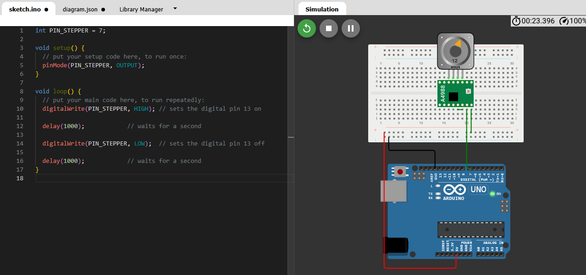
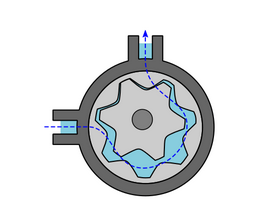
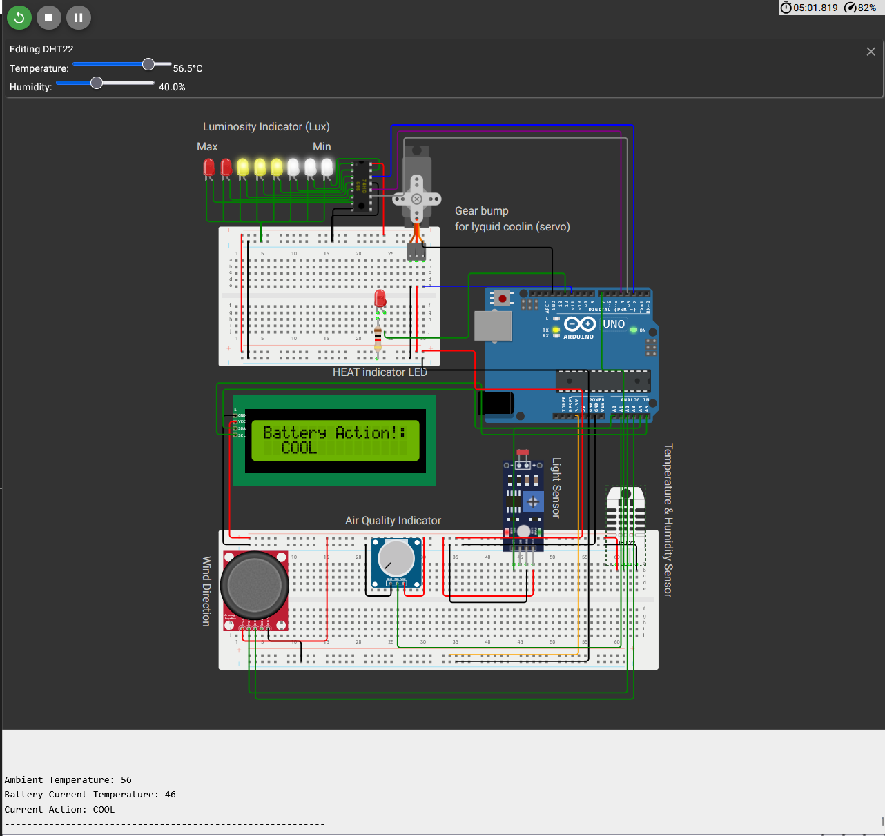

# 🔵 Actividad 2 - Equipos e Instrumentación Electrónica

**NOTAS:** 
- **Todo el código del repositorio estará comentado en inglés para evitar caracteres como ñ y así errores de compilación.**
- **El proyecto final puede probarse en [este link](https://wokwi.com/projects/431134122051145729), aunque al final de este readme se justifica su desarrollo.**


En la presente actividad (actividad 2 de la asignatura), partiremos del proyecto desarrollado en la actividad 1 para, en base a los parámetros medidos en la boya meteorológica, ser capaces de aplicar una acción de control sobre actuadores situados en la misma. En este caso, actuadores resistivos, que a partir del conocimiento del estado del clima mediante la medición de sus indicadores fundamentales (temperatura, humedad, iluminación, calidad del aire, viento…) determinarán las acciones de control y actuación que garanticen que el sistema de baterías se mantenga alrededor de los parámetros deseados (25 grados de temperatura y humedad al 80%).


## Estructura del proyecto e introducción

En primer lugar se llevará a cabo el desarrollo de los ejemplos propuestos en la actividad. Estos ejemplos se encuentran en la siguiente ruta:

```bash
  code
    |
    |
    ejemplos_propuestos
                    |
                    |- /ejemplo_1/
                    |
                    |- /ejemplo_2/
                    |
                    .
                    .
                    .
```

Finalmente se incorporarán todos los elementos en el proyecto final, que incluye los siguientes archivos:

```bash
  code
    |
    |- /ejemplos_propuestos/
    |              |
    |              |- /ejemplo_1/
    |              |- /ejemplo_2/ 
    |              |- ... 
    |
    |- diagram.json
    |
    |- libraries.txt
    |
    |- sketch.ino 
    |
    |- wokwi-project.txt

```


Antes de proceder he realizado una actualización del proyecto anterior por el siguiente motivo. En mi proyecto anterior hago uso de **delay()** para dar lugar al usuario a leer la información en pantalla. Resulta que esta instrucción es **bloqueante** por lo tanto resulta imposible hacer un control contínuo y en tiempo real de las variables de control y actuación que vamos a implementar en esta actividad. En el commit **08b91d1441e859ebd8cf3dd0dfaee7a83c15ee72** de la rama **main** puede observarse esta actualización, que nos permite empezar con la actividad. Estos cambios hacen uso de la instrucción **millis()** como se muestra a continuación:
```C
unsigned long currentMillis = millis();
.
.
.
if (currentMillis - previousMillisDisplay >= displayInterval || batteryAction != "NONE") {
    previousMillisDisplay = currentMillis;
    .
    .
    .
}
```

Esta instrucción, colocada en el loop del proyecto, es no bloqueante. Cada vez que se ejecute millis() podemos tener un timestamp que nos servira para comprobar si ha pasado el tiempo deseado. Si ha pasado, el tiempo deseado, entramos en el *if*, sino, no entramos. De esta forma, evitamor parar el programa en una línea y permitimos que otras acciones se lleven a cabo mientras tanto.

A continuación, se desarrollarán los ejemplos de circuitos simples propuestos en la actividad que servirán para llevar a cabo nuestro objetivo: Realizar un control sobre los actuadores (actuadores resistivos para calentar las baterías durante la noche y control de válvulas para líquidos refrigerantes durante el día) para mantener las baterías de la boya meteorológica en buen estado.


## Desarrollo de ejemplo : Aplicación Servomotor 

El primer ejemplo interesante a implementar es el servo. Como en wokwi no disponemos de otro motor (además del stepper, que veremos más adelante), implementaremos el servo que puede ser usado para controlar una válvula que permita o impida el paos de líquido refrigerante para enfriar el sistema de baterías.

Para implementarlo el control del servo, en este ejemplo hago uso de la librería [Servo.h](https://www.arduinolibraries.info/libraries/servo). 

Este ejemplo consiste simplemente en conseguir movimiento por parte del servo. En el ejemplo final este movimiento será gobernado por una acción de control dependiente de la temperatura para el correcto funcionamiento de las baterías. 

A continuación, se observa el ejemplo de servo desarrollado. En este ejemplo el servo se mueve en ambas direcciones 180 grados.


## Desarrollo de ejemplo : Aplicación motor paso a paso

En este ejemplo se implementará el código y conexionado necesario para implementar un motor paso a paso en Arduino. Este motor tiene un comportamiento al anterior. Este motor se moverá tantas posiciones como pulsos se emitan. Por tanto, puede ser una forma alternativa de actuador sobre nuestro sistema de flujo refrigerante. La elección del motor paso a paso o servomotor para la aplicación de la boya meteorológica se justificará al final de este Readme.

Para usar el motor paso a paso necesitamos un integrado adicional, conocido como driver chip, que puede proporcionar grandes cantidades de corriente a la bobina del motor. Wokwi soporta el driver A4988, por lo que es el que usaremos en esta actividad. Realmente podríamos conectar directamente el motor a Arduino, puesto que el motor de Wokwi no tiene en cuenta simulación de corriente. Pero implmentaré el driver para darle mayor realismo. Además, con el driver, solo necesitamos usar un pin del Arduino. En caso contrario ocuparíamos 4 pines que pueden ser necesario para otros módulos. En este ejemplo, vemos que por cada pulso, el motor se mueve 1.8 grados (necesarios 200 pasos para una revolución completa).




## Desarrollo de ejemplo : Control de leds con 74HC595

En este ejemplo vamos a aprender a controlar una serie de salidas (en este caso leds) a partir de una comunicación serie, en este caso SPI (Serial Peripheral Interface). A partir de tres pines (data, clock, latch) podemos enviar bytes de instrucción por serie al integrado para desempeñar distintas funciones. Esto tiene la principal ventaja de que se reduce considerablemente el número de puertos usados en el Arduino. 

En este ejemplo se implementa el integrado 74HC595 para poder encender y apagar secuencialmente los leds. Este ejemplo resultará útil para implementar en nuestro proyecto de la boya meteorológica, puesto que puede servir para mostrar los niveles de intensidad lumínica.

A continuación se muestra la implementación en Wokwi.


## Desarrollo de ejemplo : Control de leds con 74HC595 a partir de LDR

En este ejemplo usaremos la salida del LDR para poder hacernos una idea de la intensidad lumínica a partir de un array de LEDS (desarrollado en el ejemplo anterior).
En este ejemplo se realiza un mapeo de los posibles valores de salida del fotoresistor para mostrar un número de leds encendido en función de la intensidad de luz recibida. El mapeo puede entenderse como una regla de tres que, nos genera un número acotado en un rango deseado, dado un valor en un rango inicial. Se puede leer más sobre la función map aquí [map()](https://docs.arduino.cc/language-reference/en/functions/math/map/).

El código clave que nos permite mapear el valor de salida del LDR en su equivalente en LEDs viene dado por el siguiente código.


```C
    int luxValue = getLux();

    // constrain the value before mapping
    int constrainedLux = constrain(luxValue, 0, 10000); 

    // map to 0-8 because we have 8 leds
    int ledsToTurnOn = map(constrainedLux, 0, 10000, 0, 9);

    // avois getting out of range
    ledsToTurnOn = constrain(ledsToTurnOn, 0, 8); 

    // Turn on the necessary LEDs
    for (int i = 0; i < ledsToTurnOn; i++) {
        shiftWrite(i, HIGH);
    }

    // Turn off the rest
    for (int i = ledsToTurnOn; i < 8; i++) {
        shiftWrite(i, LOW);
    }

```


##
## Desarrollo de la funcionalidad completa

Una vez terminados los ejemplos, debemos estudiar cuales son aquellos que nos conviene para implementar nuestra funcionalidad deseada. Nuestro objetivo es mantener la batería de las baterías a una temperatura constante. Esto implica tener capacidad de sensorizar la temperatura ambiente (ya implementada en la actividad 1) y poder actuar sobre la batería en función de ella. 

Dicho esto, se procede a diseñar el siguiente sistema de regulación de temperatura para las baterías:

- Cuando las baterías superen los 50ºC se hará circular un fluido refrigerante con una serie de conductos. Para ello, se eligirá un servomotor, puesto que a altas velocidades presenta más fuerza que un stepper. Por ello, el ejemplo_1 de stepper será el añadido a la aplicación de la actividad 1. A continuación podemos ver como el servo empujaría el fluido refrigerantes a través del sistema de baterías.


    
- Cuando las baterías se encuentren por debajo de 5ºC, un conjunto de resistencias calefactables calentarán el sistema de baterías. Esto se modelará a partir de un led con con una resistencia Pull-down.

Para este tipo de control, es necesario implementar un sistema de histéresis. De esta forma evitaremos que el sistema actuador sea demasiado repetitivo con el fin de mantener la temperatura objetivo.

Con este fin, se ha desarrollado el siguiente esquema de histéresis.


```C
   
/* Hysteresis diagram --> Level 0: Heat battery, Level 1: Do nothing, Level 2: Cool Battery
 *
 *
 *   level
 *   ^
 *   |
 * 4_|
 *   |
 *   |
 *   |
 * 3_|
 *   |
 *   |
 *   | 
 * 2_|. . . . . . . . __________
 *   |                |  |      
 *   |                v  ^      
 *   |                |  |      
 * 1_|. . .___________|__|            
 *   |     |  |       .  .      
 *   |     v  ^       .  .      
 *   |     |  |       .  .      
 * 0_|_____|__|______________________________________|  temperature in centigrades
 *         |  |       |  |      
 *         5  10     45  50    
 *
 */

```

Este esquema indica como tenemos 3 niveles y 4 thresholds. Los niveles significan lo siguiente:

- **2** **-->** Las baterías necesitan enfriado (en el código denominado "cooling").
- **1** **-->** Las baterías se encuentran en una franja de temperatura aceptable (en el código denominado "none").
- **0** **-->** Las baterías necesitan ser calentarse (en el código denominado "heat").

Además, una vez establecida la temperatura ambiente, cuando nuestros actuadores (líquido refrigerante o resistencia calefactable) actúan sobre el sistema de baterías, la temperatura de las baterías no cambia de forma inmediata. Se ha programado teniendo en cuenta que, una vez se actúa sobre la batería (supongamos enfriándola) la temperatura de esta decrece lentamente (1 grado por cada 500 ms, que viene dado por la variable *deltaTemperatureInterval*) hasta alcanzar 45 grados. Después, como se ha dejado de actuar, la temperatura volverá a subir hacia la temperatura ambiente. Una vez alcance 50 de nuevo, se comenzará a refrigerar de nuevo. En este proceso de enfriamiento, podemos ver como el servo actua como válvula de acceso del fluido. Y así sistematicamente (y análogamente para temperaturas frías).

Para definir este comportamiento de histéresis me he inspirado del código encontrado en el [siguiente repo.](https://github.com/lille-boy/hysteresis/blob/master/hysteresis.c)
No obstante, este código ha tenido que ser adaptado para nuestro caso, modificando los parámetros para dar lugar a un ciclo de histéresis de 2 niveles (en lugar de 4) con diferentes thresholds. Esta configuración personalizada se muestra a continuación.


```C
   
struct threshold {
    unsigned int low;
    unsigned int high;
    unsigned int level;
};

// number os thresholds
const int NB_THRESHOLDS = 2;

// definition of the thresholds
const struct threshold thresholds[NB_THRESHOLDS] = {
    {5, 10, 1},   // low, high, level
    {45, 50, 2}
};

// Hysteresis function (inspiration from https://github.com/lille-boy/hysteresis/blob/master/hysteresis.c)
unsigned int hysteresis(unsigned int input_temp) {
    static unsigned int current_level = 0;
    static unsigned int prev_temp = 0;

    if (input_temp >= prev_temp) {
        // Ascending - use high threshold
        for (int i = 0; i < NB_THRESHOLDS; i++) {
            if (input_temp >= thresholds[i].high && thresholds[i].level > current_level) {
                current_level = thresholds[i].level;
            }
        }
    } else {
        // Descending - use low threshold
        for (int i = NB_THRESHOLDS - 1; i >= 0; i--) {
            if (current_level == thresholds[i].level && input_temp <= thresholds[i].low) {
                current_level = thresholds[i].level - 1;
                break;
            }
        }
    }

    prev_temp = input_temp;
    return current_level;
}

```


Una vez desarrollada la lógica de la histéresis podemos aplicarla de forma no bloqueante en nuestro *loop()* con el siguiente código, que se encarga de la gestión en tiempo real de la actuación sobre el sistema de baterías. En este código se ve como la temperatura de la batería siempre va a ir siguiendo la temperatura ambiente (a un ritmo de 1 grado por 500ms) hasta alcanzarla. La temperatura de las baterías variará si hay actuación sobre ella, bien por el líquido refrigerante o bien por el sistema de resistencias calefactables.

```C
  // This part of the code is the one in charge of managing the actions of the hysteresis
  if(currentMillis - previousMillisTemperature >= deltaTemperatureInterval){
    previousMillisTemperature = currentMillis;

    if(currentBatteryTemp != (int)lastTemperature && abs(currentBatteryTemp - (int)lastTemperature)  > 0.5){
      unsigned int currentLevel = hysteresis((int)currentBatteryTemp);

      if(currentLevel == 1){ // the battery does not need action
        batteryAction = "NONE";
        myservo.write(-90);
        digitalWrite(HEAT_RESISTOR, LOW);
        if(currentBatteryTemp - (int)lastTemperature < 0){
        currentBatteryTemp += 1;
        }else{
          currentBatteryTemp -= 1;
        }
      }

      if(currentLevel == 2){ // the battery needs cooling
        batteryAction = "COOL";
        myservo.write(90);
        currentBatteryTemp -= 1;
      }

      if(currentLevel == 0){ // the battery needs heat
        batteryAction = "HEAT";
        digitalWrite(HEAT_RESISTOR, HIGH);
        currentBatteryTemp += 1;
      }
      
      // emulating a clear log to read better
      clearSerialMonitor();

      Serial.println("----------------------------------------------------------");
      Serial.println("Ambient Temperature: " + String((int)lastTemperature));
      Serial.println("Battery Current Temperature: " + String(currentBatteryTemp));
      Serial.println("Current Action: " + batteryAction);
      Serial.println("----------------------------------------------------------");

    }

  }
```

Adicionalmente, se ha implementado en la solución final el ejemplo del driver de leds para intensidad lumínica. El resto de sensores funcionan de acuerdo a la actividad 1 pero sin usar *delay()*, que son instrucciones bloqueantes.

La implementación completa se muestra a continuación y puede probarse en [este link](https://wokwi.com/projects/431134122051145729):


## Made with ❤️ by 

- [@ginestopo](https://github.com/ginestopo) (Ginés Díaz Chamorro)


## License

[](https://choosealicense.com/licenses/mit/)
